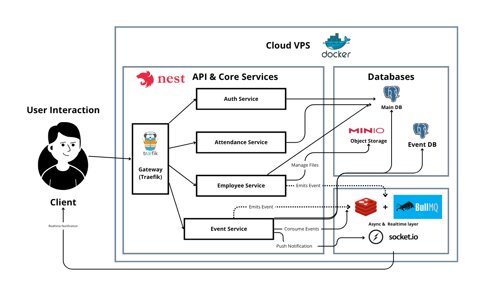

# Dexa Attendance Microservices

A production-ready, microservices-based attendance system built with NestJS. It includes authentication, employee management with photo uploads, attendance tracking, real-time notifications, audit logging, and a gateway layer for routing and WebSocket delivery.

## Table of Contents

- [Overview](#overview)
- [Architecture](#architecture)
  - [Application Architecture](#application-architecture)
- [Features](#features)
  - [Gateway](#gateway)
  - [Auth Service](#auth-service)
  - [Employee Service](#employee-service)
  - [Attendance Service](#attendance-service)
  - [Event Service](#event-service)
  - [Shared Libraries](#shared-libraries)
- [Tech Stack](#tech-stack)
- [Setup](#setup)
  - [Prerequisites](#prerequisites)
  - [Environment Variables](#environment-variables)
  - [Local Development](#local-development)
  - [Production Deployment](#production-deployment)
- [API Summary](#api-summary)
- [Event Streams](#event-streams)
- [Troubleshooting](#troubleshooting)

## Overview

This repository organizes four NestJS services and a gateway:

- `auth-service`: User authentication, registration, and credential management.
- `employee-service`: Employee CRUD, profile updates, photo uploads to MinIO, and event emission.
- `attendance-service`: Attendance operations (check-in/out), queries and aggregation.
- `event-service`: Notification APIs, WebSocket gateway, audit logs, and event processing.
- `gateway`: Lightweight facade service; production deployment uses Traefik for routing.

Two PostgreSQL databases are provisioned:

- `main`: Operational data (users, attendance, etc.).
- `events`: Event and audit logs.

Redis and BullMQ provide event streaming and background task processing. MinIO stores user photos.

## Architecture

### Application Architecture (Production)



## Features

### Gateway

- Acts as facade in development. In production, Traefik routes domain and path prefixes to services.
- Provides a base for future API aggregation and cross-service utilities.

### Auth Service

- Endpoints for `register`, `login`, and `change-password`.
- Issues JWTs with configurable expiry (`JWT_SECRET`, `JWT_EXPIRES_IN`).
- Persists users to `Postgres Main` via Prisma.
- Emits events to BullMQ for audit/notification processing.

### Employee Service

- Endpoints for creating, listing with filters/pagination, retrieving by ID, updating, and deleting employees.
- Soft delete implemented via `isDeleted` (stored as `is_deleted`) to retain history.
- Profile management endpoints with photo uploads to MinIO.
- Filters list queries to exclude soft-deleted records; detail endpoints return deleted status.
- Emits events on create/update/delete to the event stream for audit and notifications.

### Attendance Service

- Attendance operations: check-in, check-out, and list queries.
- Uses Redis/BullMQ to emit attendance events for downstream processing.
- Persists records to `Postgres Main` via Prisma.

### Event Service

- Notification REST APIs with pagination and read/unread status.
- WebSocket gateway (`/socket.io`) for real-time notifications.
- Audit log endpoints and processing.
- Event processor consumes BullMQ queues and writes to `Postgres Events`.

### Shared Libraries

- `@app/common`: DTOs (pagination, etc.), guards, utilities for cross-service consistency.
- `@app/prisma-main`: Prisma client wrappers for the main database.
- `@app/prisma-events`: Prisma client wrappers for the events database.

## Tech Stack

- NestJS 11, TypeScript
- Prisma ORM 6, PostgreSQL (main and events)
- BullMQ, Redis 7
- MinIO (S3-compatible object storage)
- Docker Compose, Traefik, Cloudflare DNS

## Setup

### Prerequisites

- Docker and Docker Compose installed.
- Node.js 18+ and npm (for local runs and Prisma tooling).
- A domain configured in Cloudflare (for production with Traefik).

### Environment Variables

Copy `.env.example` to `.env` and provide required values. For production deploy (`docker-compose.prod.yml`), ensure:

- `DOMAIN`: Public domain for routing.
- `POSTGRES_PASSWORD`: Password for Postgres containers.
- `JWT_SECRET`: JWT signing secret.
- `MINIO_ROOT_USER`, `MINIO_ROOT_PASSWORD`, `MINIO_BUCKET_NAME`.
- Optional: `TRAEFIK_EMAIL` for Let’s Encrypt.

### Local Development

1) Start infrastructure (databases, Redis, MinIO):

```bash
npm run docker:up
```

2) Generate Prisma clients (main and events):

```bash
npm run prisma:generate
```

3) Apply schema migrations to local databases:

```bash
npm run prisma:migrate:new:main
npm run prisma:migrate:new:events
```

4) Seed main database (optional):

```bash
npm run seed:main
```

5) Start services in watch mode:

```bash
npm run start:auth
npm run start:employee
npm run start:attendance
npm run start:event
```

Or start all concurrently:

```bash
npm run start:all
```

### Production Deployment

1) Ensure `.env` contains all required production secrets and `DOMAIN`.

2) Build and start with Traefik routing:

```bash
docker-compose -f docker-compose.prod.yml up -d --build
```

3) Deploy Prisma migrations inside service containers:

```bash
docker-compose -f docker-compose.prod.yml exec employee-service npm run prisma:migrate:deploy:main
docker-compose -f docker-compose.prod.yml exec event-service npm run prisma:migrate:deploy:events
```

4) Verify logs:

```bash
docker-compose -f docker-compose.prod.yml logs -f
```

## API Summary

- `Auth`: `/api/auth` – register, login, change password.
- `Employees`: `/api/employees` – CRUD and list; `/api/profile` – update profile and photo upload.
- `Attendance`: `/api/attendance` – check-in/out, list.
- `Events`: `/api/notifications`, `/api/audit-logs`, `/socket.io` (WebSocket).

Authentication uses Bearer JWT across services.

## Event Streams

- Services emit events to BullMQ (Redis), primarily on employee and attendance changes.
- The Event Service consumes queues, produces notifications, and writes audit records to `Postgres Events`.
- Real-time notifications are delivered via WebSocket (`/socket.io`).

## Troubleshooting

- Prisma type errors after schema changes: regenerate clients

```bash
npm run prisma:generate
```

- Migrations not applied in production: run migrate deploy in containers

```bash
docker-compose -f docker-compose.prod.yml exec employee-service npm run prisma:migrate:deploy:main
docker-compose -f docker-compose.prod.yml exec event-service npm run prisma:migrate:deploy:events
```

- MinIO access in production: ensure `MINIO_PUBLIC_BASE_URL`, `MINIO_PUBLIC_PREFIX`, and Traefik labels are set.

- WebSocket behind Traefik: confirm `event-service` has WS router labels and uses HTTPS.
